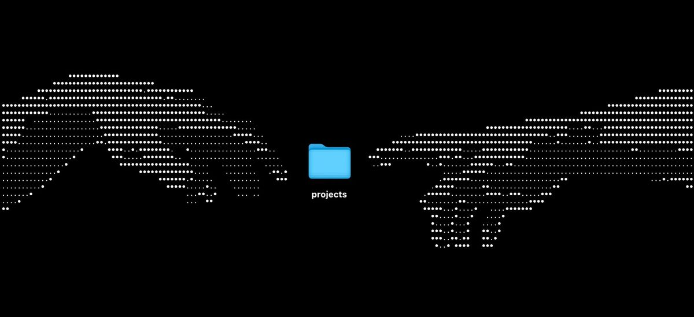

<!-- ========================================================= -->
<!--                      CUSTOM BANNER                        -->
<!-- Replace banner.png with your own banner in the repository -->
<!-- ========================================================= -->

<p align="center">

</p>

<h1 align="center">Hi, I'm Preetha 👋</h1>

<h3 align="center">
Building Intelligent Systems across AI, Cybersecurity & Computational Science
</h3>

<p align="center">


</p>

<p align="center">

<a href="mailto:vpreetha13@gmail.com">

</a>

<a href="https://www.linkedin.com/in/preetha-venkatasubramanian-715b1032a/">

</a>


</p>

---

#  About Me

```python
class Preetha:

    def __init__(self):
        self.role = "Computer Science Undergraduate"
        self.location = "Chennai, India"

        self.interests = [
            "Artificial Intelligence",
            "Computational Biology",
            "Cybersecurity",
            "Healthcare AI",
            "Post-Quantum Cryptography",
            "Software Engineering"
        ]

        self.current_focus = [
            "Research",
            "Building useful software",
            "Learning something new every day"
        ]

    def philosophy(self):
        return "Building today what I want to understand tomorrow."
```

---

#  Research Interests


- Artificial Intelligence
- Computational Biology
- Biomedical NLP
- Cybersecurity
- Foundation Models
- Secure AI Systems
- Post-Quantum Cryptography
- Human-Centered Computing

<br>

---

#  Currently Exploring

- Large Language Models
- Agentic AI Systems
- Biomedical Foundation Models
- High Performance Computing
- Secure Machine Learning
- Privacy Preserving AI
- Distributed Systems

---

#  Tech Stack

### Languages

<p align="center">


</p>

### AI • Data • Research

<p align="center">


</p>

### Development

<p align="center">


</p>

---

#  GitHub Analytics

<p align="center">


</p>

<p align="center">


</p>

---

#  Activity Graph

<p align="center">


</p>

---

#  GitHub Trophies

<p align="center">


</p>

---

#  Weekly Development Breakdown

<p align="center">


</p>

> Remove this section if you don't use WakaTime.

---

#  Learning Philosophy

<div align="center">

> *"Curiosity is my favorite algorithm."*

> *"Research begins with questions. Engineering turns them into reality."*

</div>

---

#  Connect

<p align="center">

<a href="mailto:vpreetha13@gmail.com">

</a>

&nbsp;&nbsp;&nbsp;

<a href="https://www.linkedin.com/in/preetha-venkatasubramanian-715b1032a/">

</a>

</p>

---

<p align="center">


</p>

